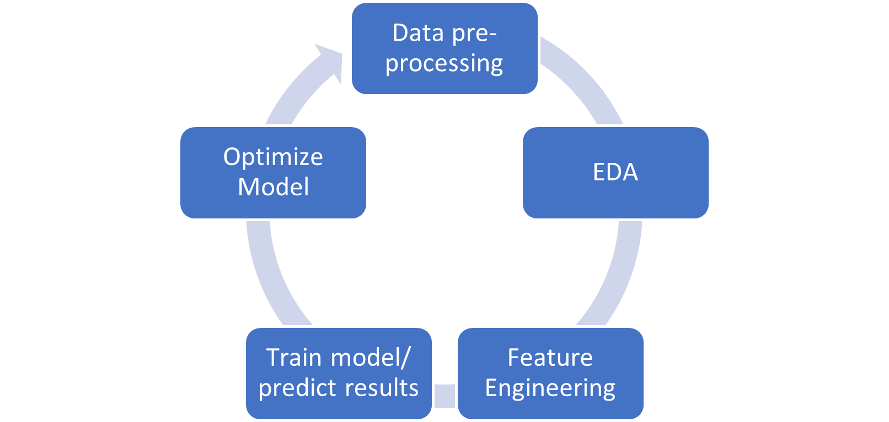

By: Tamera Brown, Talent Path: D2

## Overview

This project predicts the fare amount (inclusive of tolls) for a taxi ride in New York City given the pickup and dropoff locations. 

## Objective

My Objective is to create a set of models with the dataset I cleaned to achieve an accuracy score at least 70% with a low RMSE Score. I will then select a model and incorporate it into a small python application using flask.

## Business Value

With this model, a person that takes the taxi in New York City will be informed beforehand of the price of the trip, instead of being surprised at the end of the trip.

## Heroku Deployment

[NYC Fare](https://nyc-taxi-fare-predict.herokuapp.com/)

## Technology Stack

* [Jupyter Notebook](https://jupyter.org/) 

* [Python](https://www.python.org/)

* [Scikit-learn](https://scikit-learn.org/stable/)

* [Postgres](https://www.postgresql.org/)

* [Flask](https://flask.palletsprojects.com/en/2.0.x/)

  

## Machine Learning Pipeline

## Data Pre-Processing

This dataset include data from NYC Taxi Rides found on [Kaggle](https://www.kaggle.com/c/new-york-city-taxi-fare-prediction/overview) which contains 55M rows spanning over 7 years (2009-2015). I worked with the subset of that data with the year 2014, which has 8M rows.

Consists of :

pickup_datetime - timestamp value indicating when the taxi ride started.
pickup_longitude - float for longitude coordinate of where the taxi ride started.
pickup_latitude - float for latitude coordinate of where the taxi ride started.
dropoff_longitude - float for longitude coordinate of where the taxi ride ended.
dropoff_latitude - float for latitude coordinate of where the taxi ride ended.
passenger_count - integer indicating the number of passengers in the taxi ride.
fare_amount - float dollar amount of the cost of the taxi ride. 

## EDA
- Missing Values
- Range for longitude and latitude coordinates
- Harversine Formula
- Outliers

### Missing Values

There were only 752 rows missing 

## Ranges for coordinates

`Longitude Boundary in train data
(-173.342034, 169.972765)

Latitude Boundary in train data
(-23.421967, 69.280403)
`

#### Harversine Formuula

 
	
	

### Passenger Outlier Removal

  

### Fare Outlier Removal

  

### Distance Outlier Removal

  

## Feature Engineering

- Convert pickup dataframe from UTC to EST and account for daylight savings time
- Extracted the weekday, date, hour, month, hoilday, and rush hour from the pickup dataframe

`nycfare_2014_df['pickup_datetime'] = nycfare_2014_df['pickup_datetime'].str.replace(" UTC", "")
nycfare_2014_df.pickup_datetime=pd.to_datetime(nycfare_2014_df.pickup_datetime,format='%Y-%m-%d %H:%M:%S')
nycfare_2014_df['key'] = nycfare_2014_df['key'].str.replace(" UTC", "")
nycfare_2014_df.key=pd.to_datetime(nycfare_2014_df.key,format='%Y-%m-%d %H:%M:%S')
nycfare_2014_df['pickup_datetime']=nycfare_2014_df['pickup_datetime'].dt.tz_localize('UTC')
nycfare_2014_df['pickup_datetime'] = nycfare_2014_df['pickup_datetime'].dt.tz_convert('US/Eastern')`

`nycfare_2014_df['date']=nycfare_2014_df.pickup_datetime.dt.day
nycfare_2014_df['weekday']=nycfare_2014_df.pickup_datetime.dt.weekday
nycfare_2014_df['hour'] = nycfare_2014_df.pickup_datetime.dt.hour
nycfare_2014_df['minute'] = nycfare_2014_df.pickup_datetime.dt.minute
nycfare_2014_df['month'] = nycfare_2014_df.pickup_datetime.dt.month
cal=calender()
holidays=cal.holidays(start=nycfare_2014_df['pickup_datetime'].min(),end=nycfare_2014_df['pickup_datetime'].max())
nycfare_2014_df['holiday']=nycfare_2014_df['pickup_datetime'].isin(holidays)
nycfare_2014_df['holiday']=nycfare_2014_df['holiday'].map({False:0,True:1})
nycfare_2014_df['rush_hour']=((nycfare_2014_df['hour']>=16) & (nycfare_2014_df['hour']<=20)).astype(int)`
  
 
  
## Correlation Heatmap

 
 
 

 
  
## Modeling & Anaysis
 
 I used 80% of the data for train, 20% for test
 
      `from sklearn.model_selection import train_test_split
	X = nycfare_2014_df[['passenger_count','month','date','hour','distance']]
	y = nycfare_2014_df['fare_amount']
	X_train, X_test, y_train, y_test = train_test_split(X,y, test_size = 0.2, random_state=42)
	print(X_train.shape,y_train.shape,X_test.shape,y_test.shape)
	
	(4812725, 5) (4812725,) (1203182, 5) (1203182,)`
  

### Model 1: XGBoost Regressor
 
 - Accuracy (train data): 70%       				
 - Accuracy (test data): 70%                 
 - RMSE: 2.34

 
### Model 2: SLR
 								    
 - Accuracy (train data): 54%
 - Accuracy (test data): 54%
 - RMSE: 2.88

### Model 3: MLR

 - Accuracy (train data): 68%
 - Accuracy (test data): 68%
 - RMSE: 2.40
 
 

### Model 4: Ridge Regressor

- Accuracy (train data): 54%
- Accuracy (test data): 54%
- RMSE: 2.88

### Model 5: Lasso Regressor

- Accuracy (train data): 54%
- Accuracy (test data): 54%
- RMSE: 2.88

### Model 6: LGB Regressor

- Accuracy (train data): 69%
- Accuracy (test data): 69%
- RMSE: 2.36

## Conclusion

In conclusion, I have selected the Extreme Gradient Boosting Regressor as my candidate model as it provided me with both high and consistent accuracy throughout both train and test data as well as provide the lowest RMSE score.