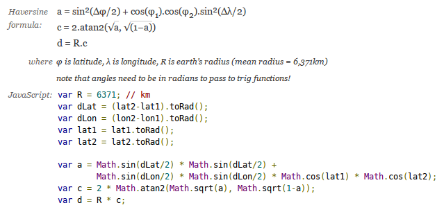
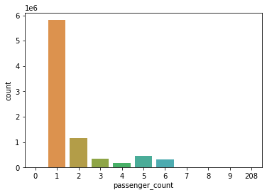
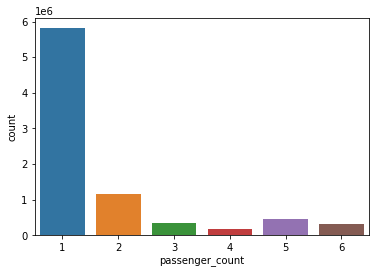
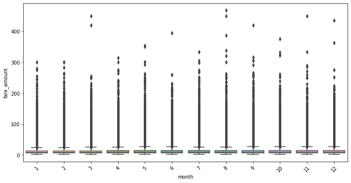
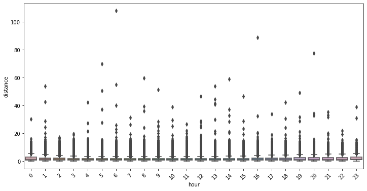
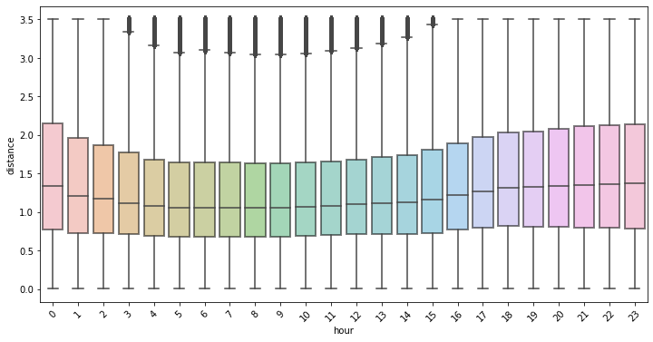
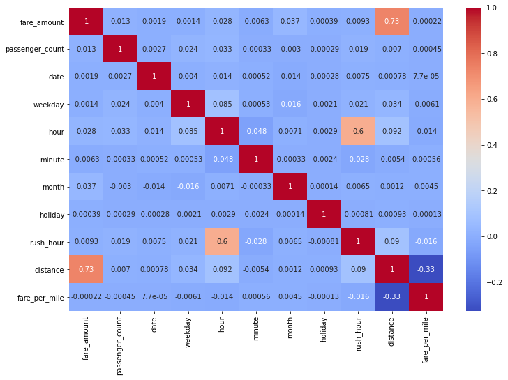

By: Tamera Brown, Talent Path: D2

## Overview

This project predicts the fare amount (inclusive of tolls) for a taxi ride in New York City given the pickup and dropoff locations. 

## Technology Stack

* [Jupyter Notebook](https://jupyter.org/) 

* [Python](https://www.python.org/)

* [Scikit-learn](https://scikit-learn.org/stable/)

* [Postgres](https://www.postgresql.org/)

* [Flask](https://flask.palletsprojects.com/en/2.0.x/)

  

## Machine Learning Pipeline

## Data Pre-Processing

This dataset include data from NYC Taxi Rides found on [Kaggle](https://www.kaggle.com/c/new-york-city-taxi-fare-prediction/overview) which contains 55M rows spanning over 7 years (2009-2015). I worked with the subset of that data with the year 2014, which has 8M rows.

Consists of :

pickup_datetime - timestamp value indicating when the taxi ride started.
pickup_longitude - float for longitude coordinate of where the taxi ride started.
pickup_latitude - float for latitude coordinate of where the taxi ride started.
dropoff_longitude - float for longitude coordinate of where the taxi ride ended.
dropoff_latitude - float for latitude coordinate of where the taxi ride ended.
passenger_count - integer indicating the number of passengers in the taxi ride.
fare_amount - float dollar amount of the cost of the taxi ride. 

## EDA
- Missing Values
- Range for longitude and latitude coordinates
- Harversine Formula
- Outliers

### Missing Values

There were only 752 rows missing 

## Ranges for coordinates

`Longitude Boundary in train data
(-173.342034, 169.972765)

Latitude Boundary in train data
(-23.421967, 69.280403)
`

#### Harversine Formuula

 
	
	

### Passenger Outlier Removal

  

### Fare Outlier Removal

  

### Distance Outlier Removal

  

## Feature Engineering

- Convert pickup dataframe from UTC to EST and account for daylight savings time
- Extracted the weekday, date, hour, month from the pickup dataframe

  
  
 
 
 
  
## Modeling & Anaysis
 
 I used 80% of the data for train, 20% for test
 
      `from sklearn.model_selection import train_test_split
	X = nycfare_2014_df[['passenger_count','month','date','hour','distance']]
	y = nycfare_2014_df['fare_amount']
	X_train, X_test, y_train, y_test = train_test_split(X,y, test_size = 0.2, random_state=42)
	print(X_train.shape,y_train.shape,X_test.shape,y_test.shape)
	
	(4812725, 5) (4812725,) (1203182, 5) (1203182,)`
  

### Model 1: XGBoost Regressor
 
 - Accuracy (train data): 70%       					
 - Accuracy (test data): 70%
 - RMSE: 2.34

 
### Model 2: SLR
 								    
 - Accuracy (train data): 54%
 - Accuracy (test data): 54%
 - RMSE: 2.88

### Model 3: MLR

 - Accuracy (train data): 68%
 - Accuracy (test data): 68%
 - RMSE: 2.40
 
### Model 4: Ridge Regressor

- Accuracy (train data): 54%
- Accuracy (test data): 54%
- RMSE: 2.88

### Model 5: Lasso Regressor

- Accuracy (train data): 54%
- Accuracy (test data): 54%
- RMSE: 2.88

### Model 6: LGB Regressor

- Accuracy (train data): 69%
- Accuracy (test data): 69%
- RMSE: 2.36
