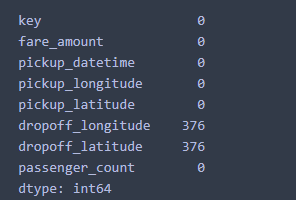
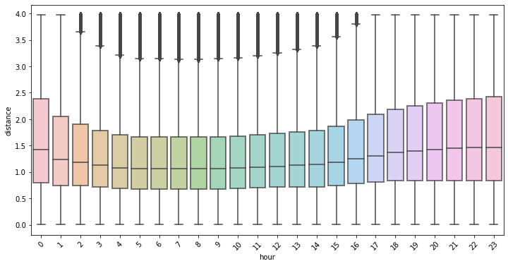

By: Tamera Brown, Talent Path: D2

## Overview

This project predicts the fare amount (inclusive of tolls) for a taxi ride in New York City given the pickup and dropoff locations. 

## Technology Stack

* [Jupyter Notebook](https://jupyter.org/) 

* [Python](https://www.python.org/)

* [Scikit-learn](https://scikit-learn.org/stable/)

* [Postgres](https://www.postgresql.org/)

* [Flask](https://flask.palletsprojects.com/en/2.0.x/)

  

## Machine Learning Pipeline

## Data Pre-Processing

This dataset include data from NYC Taxi Rides found on [Kaggle](https://www.kaggle.com/c/new-york-city-taxi-fare-prediction/overview) which contains 55M rows spanning over 7 years (2009-2015). I worked with the subset of that data with the year 2014, which has 8M rows.

## EDA
- Missing Values
- Range for longitude and latitude coordinates
- Harversine Formula
- Outliers

### Missing Values

 

#### Harversine Formula

    `from haversine import haversine
    
    def get_distance(df):
        a1 = df['pickup_latitude']
        a2 = df['dropoff_latitude']
    
    	b1 = df['pickup_longitude']
    	b2 = df['dropoff_longitude']
    
    	pick_up = (a1, b1) 
    	drop_off = (a2, b2)
    	return round(haversine(pick_up, drop_off,unit='mi'),2)`
	
	

### Passenger Outlier Removal

  

### Fare Outlier Removal

  

### Distance Outlier Removal

  

## Feature Engineering

- Convert pickup dataframe from UTC to EST and account for daylight savings time
- Exarcted the weekday, date, hour, month from the pickup dataframe
  
  
 Correlation Heatmap 
 
 
  
## Modeling & Anaysis
 
 I used 80% of the data for train, 20% for test
 
      `from sklearn.model_selection import train_test_split
	X = nycfare_2014_df[['passenger_count','month','date','hour','distance']]
	y = nycfare_2014_df['fare_amount']
	X_train, X_test, y_train, y_test = train_test_split(X,y, test_size = 0.2, random_state=42)
	print(X_train.shape,y_train.shape,X_test.shape,y_test.shape)`
  

### Model 1: XGBoost
 
 - Accuracy (train data): 69%
 - Accuracy (test data): 69%
 - RMSE: 2.12

 
### Model 2: MLR
 
 - Accuracy (train data): 67%
 - Accuracy (test data): 67%
 - RMSE: 2.19
